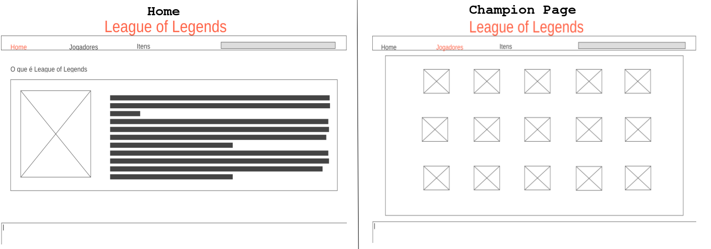

# Data Lovers - League of Legends

## Introdução:
Neste projeto foi desenvolvido uma página web para visualizar um conjunto de dados que se adeque ao que o usuário necessite.
O site permite ao usuário visualizar os dados dos personagens com uma breve descrição e também informando sobre a quantidade de ataques, defesa, magia e dificuldade.
Permite fazer uma busca através do filtro, ordena e compara até cinco personagens em Attack, HP, MP, Armor e Magic Resist, mostrado o resultado em um gráfico.

## Como funciona?
* Na página inicial, o usuário tem uma introdução do que se trata o jogo.
* Ao clicar em **Champions** o usuário é redirecionado para a página `champions.html` que possui a lista de personagens.
* Nesta página ele pode filtrar a lista de personagens pela sua classe e ordenar por ordem **alfabética** *(Crescente e Decrescente)* ou pelos seu **status** *(Crescente)* dentro jogo.
* Ao clicar em alguma foto da lista, é mostrado um perfil resumido do personagem selecionado.
* Se o usuário desejar comparar, ele clicar em **Compare** e é apresentado uma tela com um gráfico.
* Ao selecionar entre um e cinco personagens, é mostrado de inicio uma comparação em Ataque, podendo ser alterado o parâmetro de comparação.
* O usuário pode excluir um personagem que foi utilizado na comparação clicando na sua foto acima do gráfico, podendo logo em seguida adicionar outro.
* O gráfico é atualizado de forma dinâmica.

## Protótipo
* A ideia inicial do projeto:

* Começando a codar chegamos na seguinte estrutura com um filtro lateral:

Para o protótipo final, mudamos o filtro de lugar, pois ficaria mais claro e eficiente se os filtros ficassem juntos em um mesmo local do site, chegamos no resultado abaixo:
(imagem/prototipo3)

## Considerações
* Foi utilizado o arquivo [League of Legends - Challenger leaderboard](src/data/lol/lol.json) com as informações dos personagens do jogo **League of Legends**.
* Uso de gráficos `Charts.js`.

## Conteúdo
* Arquivo `index.html` e `champions.html` com estrutura do site.
* Arquivo `style.css` dentro da pasta `src/` com os estilos utilizados.
* Arquivo `lol.js` dentro da pasta `src/data/lol` com dados utilizados no projeto.

## Lista de erros encontrados com o teste de usabilidade durante o projeto
[x] Acesso as informações do arquivo lol.js. `Resolvido utilizando Object.values.`
[x] Fluidez do filtro junto do ordenador. `Resolvido atualizando a cada mudança a Array de personagens.`
[x] Filtro e ordenação não estava claro, pois foi utilizado um input check para o filtro e um select para a ordenação. `Resolvido colocando todos como select`.
[x] Dinamismo ao adicionar e remover personagens da lista de comparação. `Resolvido atualizando a Array de personagens comparados sempre que o usuário mudar a seleção.`
[] Adicionando o mesmo personagem na comparação mais de uma vez. `Não resolvido.`

## Checklist
* [x] Usar VanillaJS.
* [x] Inclui _Definição de produto_ clara e informativa no `README.md`.
* [x] Inclui esboço da solução (protótipo de baixa fidelidade e de alta fidelidade, se houver) no
  `README.md`.
* [x] Inclui a lista de problema detectados através dos testes de usabilidade
  no `README.md`.
* [x] UI: Mostra lista e/ou tabela com dados e/ou indicadores.
* [x] UI: Permite ordenar os dados por meio de um ou mais campos
  (asc e desc).
* [x] UI: Permite filtrar os dados com base em uma condição.

## Conclusão:
* Aprendizado de manipulação de Objetos em outro arquivo.
* Uso de Template String.
